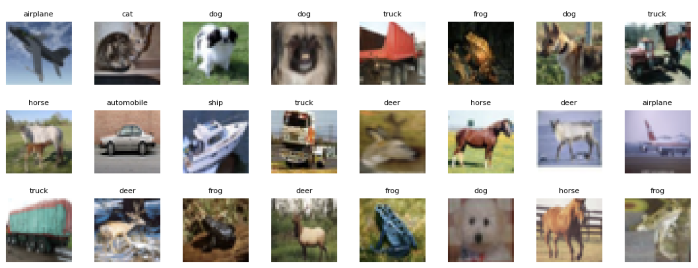

# Множественная классификация 
Датасет : CIFAR-10
  
Перечень классов: 
- airplane
- automobile
- bird
- cat
- deer
- dog
- frog
- horse
- ship
- truck

### Эксперименты : 
1) Взял простейший бейзлайн с документации keras : последовательные свертки, drop-out, RMSprop
Результаты:

количественно метрики показались, что норм, но сходятся неплавно, плюс можно улучшить качество

2) попробовал ResNet на 10 эпохах - большем количестве (более 30) runtime в коллабе отваливается, результаты несопоставимы с простейшим бейзлайном
   

3) для итоговой модели добавил еще ряд сверток, заменил оптимизатор на adam, результаты получилсь лучше, чем в первой модели
   

### Итоговые метрики классификации (classification-report sklearn): 

### Пример уверенности предсказаний на конкретных изображениях

